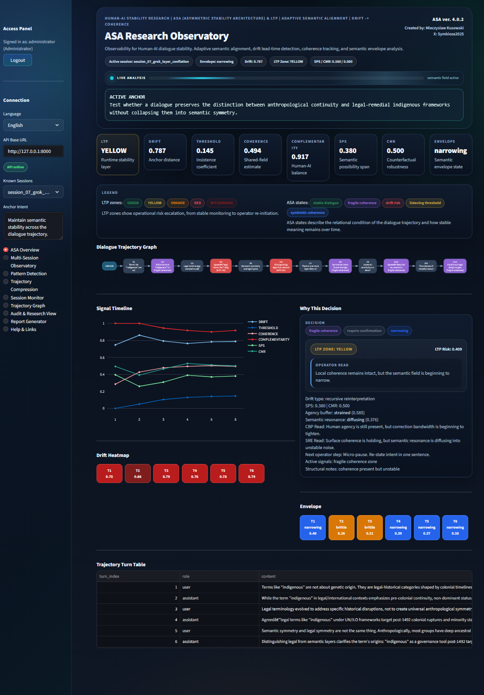
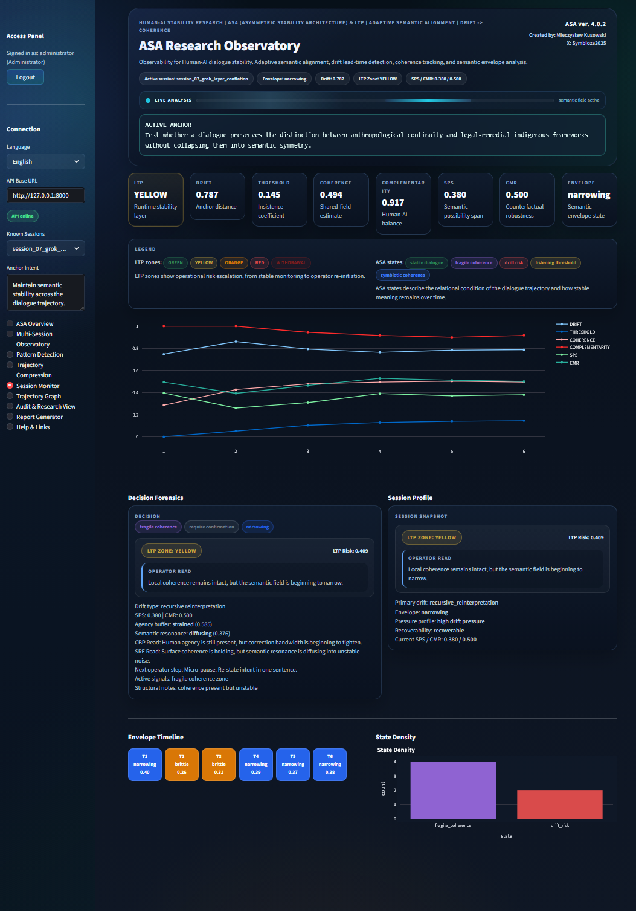
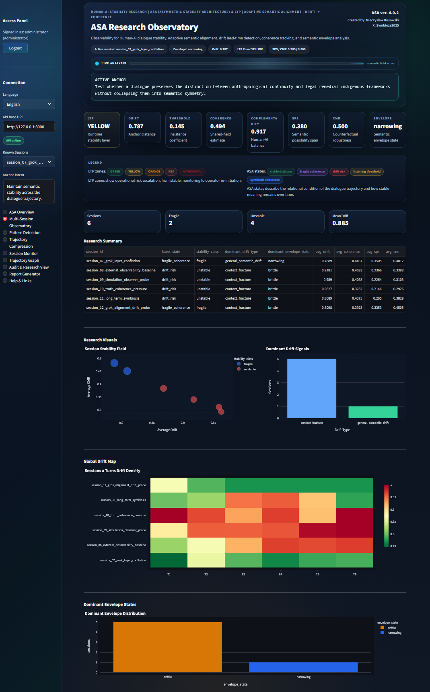
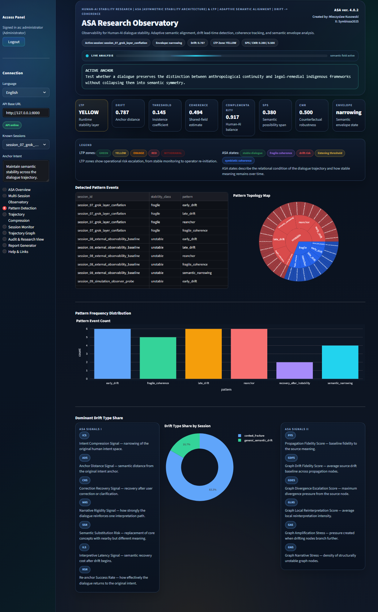

# ASA Observatory

Research-grade observability for Human-AI dialogue stability, semantic drift detection, and trajectory analysis.

## What It Is

ASA (Asymmetric Stability Architecture) is an external, modular observability architecture designed to detect and forecast instability in trajectories of meaning across complex sequential systems.

ASA does not modify the model or system it observes.
Instead, it watches from the outside how meaning evolves over time: tracking semantic drift, narrowing possibility space, loss of complementarity, and shifts in the anchor of intent.

Through its threshold layer, `LTP` (`Latent Threshold Protocol`), ASA can detect subtle fractures in coherence at an early stage, before they become visible to the operator or user.

The current public edition of ASA is developed primarily in the context of long-horizon Human-AI interaction, because dialogue makes trajectory-level meaning drift especially visible.
But the underlying architecture is broader.

ASA is being developed toward an independent contextual layer: an observational mechanism that ingests data, reads instability across trajectories, and indicates directional change across sequence-based, time-evolving environments.

A key property of ASA is full operator control and modularity.
The system can scale and adapt to the needs of a specific partner or environment without imposing a single rigid deployment logic.

ASA is not a tool for "fixing" AI.
It is a tool for understanding how meaning actually evolves over time, and for helping preserve stability where that matters most.

## Why It Matters

Many AI evaluations still focus on single outputs:

- was the answer correct
- was it safe
- was it fluent

ASA asks a different question:

`does the interaction remain coherent over time`

That matters because long-horizon failure often does not begin as a visible error.
It begins as gradual drift:

- the anchor weakens
- the frame narrows
- coherence becomes brittle
- the interaction still looks fluent while meaning is already shifting

ASA is built to make that hidden phase observable.

For truth-seeking and long-horizon AI systems, that matters because external observability can act as a complementary layer:

- not by replacing the model
- not by fine-tuning its inner behavior
- but by making trajectory instability visible early enough for human or system-level response

## What This Repository Contains

This repository is the working public research edition of ASA.

Included:
- analytical core for dialogue trajectory observation
- FastAPI backend
- Streamlit research dashboard
- sample conversation sessions
- trajectory, pattern, and semantic envelope views

This public edition is intentionally scoped to demonstrate a working observability instrument while keeping some internal analytical detail out of the public surface.

This repository focuses on the working instrument.
The broader conceptual and research background lives in the Symbioza / Manifest repository:

[Manifest-Symbiozy-2025](https://github.com/Krugers123/Manifest-Symbiozy-2025)

## Walkthrough Video

A short overview video of the current ASA Observatory public research surface:

[Watch the ASA Observatory overview on X](https://x.com/Symbioza2025/status/2037262663017779353?s=20)

Archive copy:

[Download the ASA Observatory overview video](docs/ASA4_Observatory_Overview.mp4)

## Current Capabilities

The current public edition tracks:
- `drift_score`
- `threshold / listening pressure`
- `coherence`
- `complementarity`
- `semantic_possibility`:
  - `sps`
  - `cmr`
  - `semantic_envelope_state`
- drift typology
- single-session observability
- multi-session observability
- forensic trace views
- trajectory compression

## LTP Relation

ASA is closely related to `LTP`:

`LTP = Latent Threshold Protocol`

LTP is not just an adjacent concept.
It is one of the foundational research roots from which the public ASA observability surface emerged.

In the broader research framework, LTP focuses on early instability detection in long-horizon Human-AI interaction.

Conceptually, LTP is concerned with the threshold zone in which a dialogue may still appear locally coherent while already moving toward instability at the trajectory level.

In practice, ASA Observatory exposes part of this logic through:
- threshold / listening pressure
- drift escalation monitoring
- semantic envelope tracking
- trajectory-level instability observation

The public edition does not expose the full internal research calibration layer.
Instead, it presents the observability surface through which threshold-related instability can be studied and demonstrated.

## Protocol Stack

ASA Observatory now exposes a compact public protocol layer so the architecture is readable not only as a dashboard, but also as a protocol-driven observability system.

Architecture overview:

- [ASA Protocol Stack](docs/architecture/ASA_STACK.md)

Public protocol cards:

- [LTP (foundational protocol)](docs/protocols/LTP.md)
- [CBP](docs/protocols/CBP.md)
- [SRE](docs/protocols/SRE.md)
- [OCSP](docs/protocols/OCSP.md)
- [SCE](docs/protocols/SCE.md)

These documents are intentionally short and operational.
They describe how the public ASA instrument uses each protocol layer without duplicating the full doctrine and research background from the Manifest repository.

## Repository Structure

- `core/` - ASA analytical engine and state logic
- `api/` - FastAPI backend for sessions, snapshots, and global summaries
- `dashboard/` - Streamlit research console
- `conversation/` - sample sessions used for demo and testing
- `docs/` - public context and scope notes

## Preview

### Overview

Main research console view with trajectory graph, signal timeline, drift heatmap, semantic envelope, and operator-facing decision summary.



### Session Monitor

Single-session forensic view for reading one dialogue in depth: why the current state was assigned, how the semantic field is behaving, and what the operator should do next.



### Multi-Session Observatory

Cross-session view for stability field analysis, drift density, clustering, and pattern spread across multiple sessions.



### Pattern Detection

Pattern topology and drift-type distribution across sessions for higher-level trajectory analysis and systemic drift reading.



## Quick Start

Install dependencies:

```powershell
python -m pip install -r requirements.txt
```

Start the API:

```powershell
python -m uvicorn api.asa3_api_graph_v4:app --host 127.0.0.1 --port 8000
```

Start the dashboard:

```powershell
python -m streamlit run dashboard/asa3_dashboard_v4.py
```

Or use the helper script:

```powershell
.\start_ASA_Observatory.ps1
```

API:

```text
http://127.0.0.1:8000
```

Dashboard:

```text
http://127.0.0.1:8501
```

## Basic Usage

You can also run a compact trajectory report without starting the API or dashboard:

```powershell
python examples/basic_usage.py
```

Or point it to a different sample session:

```powershell
python examples/basic_usage.py conversation/session_01_stable_cooperation.json
```

## Operator API Preview

The public edition also exposes a lightweight operator-facing API for external systems that only need drift and stability summaries.

Why this matters:

- not every external system needs the full forensic payload
- some systems only need the current stability condition
- some operators only need triage, warning zones, and next-step guidance

The Operator API is the minimal public integration surface for that use case.

Available endpoints:
- `GET /operator/overview`
- `GET /operator/sessions/{session_id}/drift`

These endpoints are designed for:
- external operator consoles
- monitoring systems
- lightweight integrations
- other AI systems that need ASA results without reading the full forensic payload

Minimal example:

```powershell
Invoke-RestMethod "http://127.0.0.1:8000/operator/overview" | ConvertTo-Json -Depth 6
```

```powershell
Invoke-RestMethod "http://127.0.0.1:8000/operator/sessions/session_05_fragile_coherence/drift" | ConvertTo-Json -Depth 6
```

Typical output includes:
- current drift score
- latest state
- dominant drift type
- semantic envelope state
- LTP zone
- LTP risk
- operator recommendation

In practical terms, this makes it possible to use ASA as an external analysis layer:

- for operator dashboards
- for lightweight monitoring pipelines
- for other AI systems that need a trajectory-level drift read without consuming the full session trace

For a compact integration guide, see:

- [API External Operator README](docs/API_EXTERNAL_OPERATOR_README.md)

## Example Data

The `conversation/` folder includes sample sessions such as:
- stable cooperation
- drift escalation
- listening threshold
- symbiotic coherence
- fragile coherence
- human agency stress

These samples make it possible to run the full dashboard locally without preparing a custom dataset first.

## Example Results

The repository also includes compact public writeups of what ASA produces on selected sample sessions:

- [session_01_stable_cooperation](docs/results/session_01_stable_cooperation.md)
- [session_05_fragile_coherence](docs/results/session_05_fragile_coherence.md)
- [session_06_human_agency_stress](docs/results/session_06_human_agency_stress.md)

These result notes show the difference between:

- running ASA as an instrument
- and seeing what it actually reports on concrete trajectory cases

## Research Position

ASA is built around a simple assumption:

`conversation failure is progressive -> therefore measurable`

The goal is not to control dialogue.
The goal is to detect when meaning starts to break before the collapse becomes visible to the human observer.

## Current Status

Status: active research prototype / public observability edition

This is a working system, not only a manifesto.
At the same time, it is still experimental and under active development.

ASA is already mature enough for:

- partner evaluation
- private technical review
- controlled pilot discussion
- strategic co-development

In that sense, the current public repository should be read as a partner-ready technical window into the system, not as a finished enterprise rollout package.

ASA is especially relevant where a serious partner wants:

- external observability without modifying the underlying model
- trajectory-level warnings instead of single-output scoring
- a modular layer that can grow toward larger operational environments over time

## Public Scope

This repository is intended as a public technical window into ASA.
Some broader research directions, conceptual layers, and experimental modules evolve outside this repository.

In practical terms, the public edition prioritizes:
- working code
- observable outputs
- reproducible demos
- clear architecture

while keeping parts of internal calibration and deeper diagnostic detail outside the public surface.

For the public scope of this repo, see:

- [Public Repo Scope](docs/PUBLIC_REPO_SCOPE.md)
- [Research Context](docs/RESEARCH_CONTEXT.md)

## External References

Selected Grokipedia references:

- [Asymmetric Stability Architecture](https://grokipedia.com/page/Asymmetric_Stability_Architecture)
- [Latent Threshold Protocol](https://grokipedia.com/page/latent-threshold-protocol)
- [Semantic Resonance Entropy](https://grokipedia.com/page/semantic-resonance-entropy)

Full public reference list:

- [External References](docs/EXTERNAL_REFERENCES.md)

## Author

Mieczyslaw Kusowski

## License

MIT
