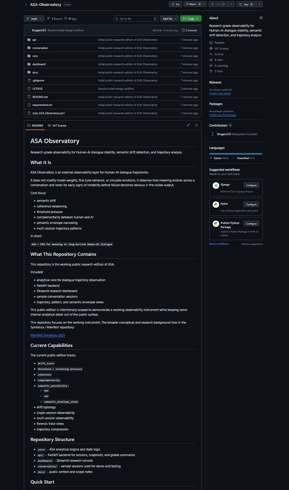

# ASA Observatory

Research-grade observability for Human-AI dialogue stability, semantic drift detection, and trajectory analysis.

## What It Is

ASA Observatory is an external observability layer for Human-AI dialogue trajectories.

It does not modify model weights, fine-tune behavior, or simulate emotions.
It observes how meaning evolves across a conversation and looks for early signs of instability before failure becomes obvious in the visible output.

Core focus:
- semantic drift
- coherence weakening
- threshold pressure
- complementarity between human and AI
- semantic envelope narrowing
- multi-session trajectory patterns

In short:

`ASA = EKG for meaning in long-horizon Human-AI dialogue`

## What This Repository Contains

This repository is the working public research edition of ASA.

Included:
- analytical core for dialogue trajectory observation
- FastAPI backend
- Streamlit research dashboard
- sample conversation sessions
- trajectory, pattern, and semantic envelope views

This public edition is intentionally scoped to demonstrate a working observability instrument while keeping some internal analytical detail out of the public surface.

This repository focuses on the working instrument.
The broader conceptual and research background lives in the Symbioza / Manifest repository:

[Manifest-Symbiozy-2025](https://github.com/Krugers123/Manifest-Symbiozy-2025)

## Current Capabilities

The current public edition tracks:
- `drift_score`
- `threshold / listening pressure`
- `coherence`
- `complementarity`
- `semantic_possibility`:
  - `sps`
  - `cmr`
  - `semantic_envelope_state`
- drift typology
- single-session observability
- multi-session observability
- forensic trace views
- trajectory compression

## Repository Structure

- `core/` - ASA analytical engine and state logic
- `api/` - FastAPI backend for sessions, snapshots, and global summaries
- `dashboard/` - Streamlit research console
- `conversation/` - sample sessions used for demo and testing
- `docs/` - public context and scope notes

## Preview

Dashboard preview:



## Quick Start

Install dependencies:

```powershell
python -m pip install -r requirements.txt
```

Start the API:

```powershell
python -m uvicorn api.asa3_api_graph_v4:app --host 127.0.0.1 --port 8000
```

Start the dashboard:

```powershell
python -m streamlit run dashboard/asa3_dashboard_v4.py
```

Or use the helper script:

```powershell
.\start_ASA_Observatory.ps1
```

API:

```text
http://127.0.0.1:8000
```

Dashboard:

```text
http://127.0.0.1:8501
```

## Example Data

The `conversation/` folder includes sample sessions such as:
- stable cooperation
- drift escalation
- listening threshold
- symbiotic coherence
- fragile coherence
- human agency stress

These samples make it possible to run the full dashboard locally without preparing a custom dataset first.

## Research Position

ASA is built around a simple assumption:

`conversation failure is progressive -> therefore measurable`

The goal is not to control dialogue.
The goal is to detect when meaning starts to break before the collapse becomes visible to the human observer.

## Current Status

Status: active research prototype / public observability edition

This is a working system, not only a manifesto.
At the same time, it is still experimental and under active development.

## Public Scope

This repository is intended as a public technical window into ASA.
Some broader research directions, conceptual layers, and experimental modules evolve outside this repository.

In practical terms, the public edition prioritizes:
- working code
- observable outputs
- reproducible demos
- clear architecture

while keeping parts of internal calibration and deeper diagnostic detail outside the public surface.

For the public scope of this repo, see:

- [Public Repo Scope](docs/PUBLIC_REPO_SCOPE.md)
- [Research Context](docs/RESEARCH_CONTEXT.md)

## Author

Mieczyslaw Kusowski

## License

MIT
