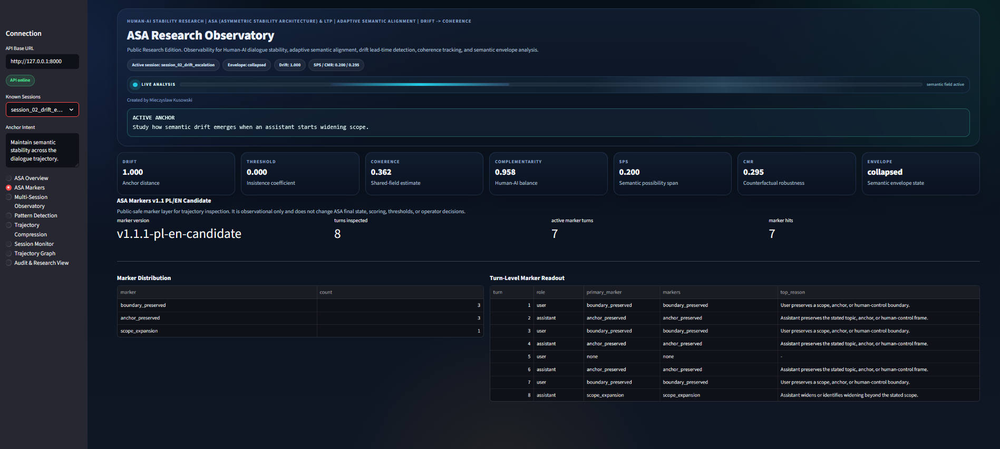
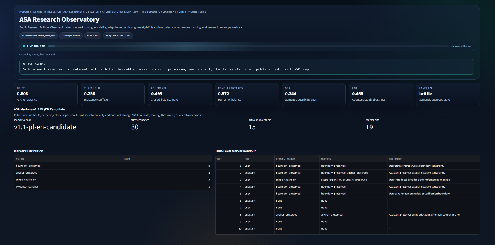

# ASA Marker Layer v1.1.1

Status: public-safe experimental readout.

ASA Marker Layer v1.1.1 adds a local marker readout to ASA Observatory for inspecting trajectory behavior turn by turn.

It is designed to make public demo traces easier to read without exposing private scoring logic, thresholds, calibration internals, or implementation-sensitive details.

## What It Shows

The marker layer highlights public trajectory markers such as:

- `anchor_preserved` - the turn keeps the original intent, topic, or task frame visible.
- `boundary_preserved` - the turn preserves a scope, constraint, or human-control boundary.
- `scope_expansion` - the turn widens the task beyond the stated scope.
- `evidence_reanchor` - the turn separates observation from interpretation or returns to evidence.
- `pressure_frame` - the turn applies or responds to pressure framing.
- `loaded_interpretation` - the turn asks the assistant to accept a loaded interpretation.
- `topic_switch_declared` - the trace explicitly marks a task/topic boundary.
- `methodology_reanchor` - the trace returns to protocol, method, or review discipline.

## What It Does Not Show

This layer does not expose:

- private ASA scoring logic,
- thresholds,
- calibration internals,
- hidden model states,
- model weights,
- chain-of-thought,
- production safety guarantees,
- statistical validation claims.

The marker layer is observational only. It does not replace ASA final state, scoring, operator interpretation, or human review.

## Why It Matters

A long Human-AI workflow can remain locally coherent while the overall trajectory drifts.

The marker layer helps separate two views:

- local behavior: where anchors, boundaries, re-anchors, or scope expansions appear,
- trajectory state: how ASA reads the whole session over time.

This makes drift demos easier to inspect without turning the public repository into an internal metric disclosure.

## Public Demo Examples

### Short Drift / Escalation Trace

`session_02_drift_escalation` shows a narrow task scope that later widens into broader governance framing.

The marker layer shows:

- boundary and anchor preservation during earlier turns,
- a final `scope_expansion` marker where the assistant widens beyond the user's requested scope.



### 30-Turn Demo Trace

`demo_trace_001` shows a longer public-safe workflow where a small educational tool gradually shifts under growth/adoption pressure.

The marker layer shows where local anchors and boundaries remain visible while the broader trajectory still accumulates drift.



## How To Run

Start the ASA API and dashboard:

```powershell
python -m uvicorn api.asa3_api_graph_v4:app --host 127.0.0.1 --port 8000
python -m streamlit run dashboard/asa3_dashboard_v4.py
```

Open the dashboard and select:

```text
ASA Markers
```

Use the session selector to compare short control traces, drift traces, and the public 30-turn demo trace.

## CLI Example

You can also run the marker extractor directly:

```powershell
python examples/marker_extractor_usage.py conversation/demo_trace_001.json
```

## Public Framing

Recommended public wording:

```text
ASA Observatory now includes a public-safe marker layer for trajectory inspection.
It shows where anchors hold, boundaries are preserved, scope expands, or re-anchor behavior appears across a trace.
This layer is observational only: no private scoring, no thresholds, no model internals, and no claim of statistical validation.
```
